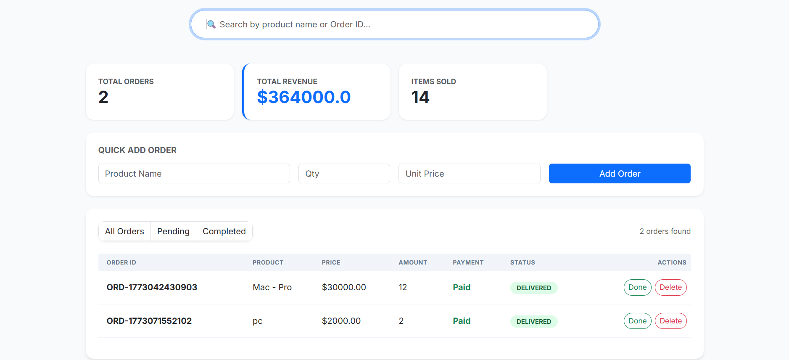
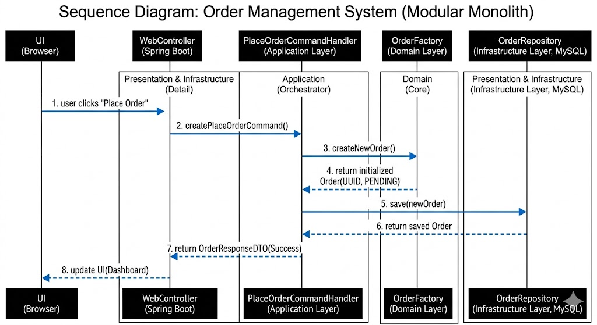

# 📦 Order Management System

### Clean Architecture | CQRS | Design Patterns

This project is a Spring Boot application designed with a strict separation of concerns to ensure maintainability and scalability.

---

# 📑 Table of Contents

### 1 Introduction

1.1 Project Introduction
1.2 System Architecture & Structure
1.3 Implementation Features

### 2 The Architectural Layers

2.1 I The Domain Layer
2.2 II The Application Layer
2.3 III Infrastructure & Presentation

### 3 Implementation of CQRS

3.1 I The Command Path (Write)
3.2 II The Query Path (Read)
3.3 III Comparison: Commands vs Queries
3.4 Architectural Conclusion

### 4 Strategic Design Patterns

4.1 I The Factory Pattern
4.2 II The Use Case Pattern
4.3 III Data Transfer Objects (DTOs)

### 5 Summary

---

## 1. Introduction

This system separates business logic from technical details (database/UI). Changes to the UI or database do not affect how an order is processed.

**Core Structure:**

* **Domain Layer:** Pure Java. Contains `Order` entity and `OrderFactory`.
* **Application Layer:** Orchestrates logic via **CQRS**.
* **Infrastructure Layer:** Handles **MySQL** persistence and **Thymeleaf** UI.

---

## 2. Implementation of CQRS

The system uses separate paths for updating data and reading data to improve performance.

| Attribute | Commands (Write) | Queries (Read) |
| --- | --- | --- |
| **Goal** | Consistency | Speed |
| **Logic** | Validation | Transformation |
| **Model** | Updates State | Fetches DTOs |

---

## 3. Design Patterns

* **Factory Pattern:** Enforces a valid initial state (ID generation, "Pending" status) for every order.
* **Use Case Pattern:** Specific handlers (e.g., `UpdateStatusHandler`) manage single business actions inside `@Transactional` boundaries.
* **DTOs:** Acts as a security buffer between the database and the UI.

---

## 4. How to Run

* **Entry Point (UI):** The flow starts at the User Interface (Thymeleaf/HTML). When a user clicks a button, data is sent as an HTTP request to the Web Controller (Spring Boot). Both are in the outermost layer.

* **Orchestration (Application):** The Controller converts that request into a meaningful intent (a Command or Query) and passes it to the Application Layer. If it changes data (like "Place Order"), it goes to a Command Handler. If it fetches data, it goes to a Query Handler. This layer orchestrates how the work is done.

* **The Heart (Domain):** The Command Handler must call the Domain Layer to proceed. For example, it asks the OrderFactory to create the order. The Factory ensures that the Order Entity is created correctly (with a valid ID and 'Pending' status) before anything else happens. The Domain Layer is at the core, protecting your business logic from outside technology.

* **Persistence (Infrastructure):** After the Domain Layer has validated and updated the entity, the Application Layer uses the OrderRepository (which implements an interface defined in the Application layer) to save the safe data into the MySQL Database.

## 5. How to Run

1. **Set Environment Variables:**
* `DB_USERNAME`: your mysql username
* `DB_PASSWORD`: your mysql password

2. **Database:** Create a schema named `order_mgmt_db` in MySQL.
3. **Build:** Run `./mvnw spring-boot:run`

