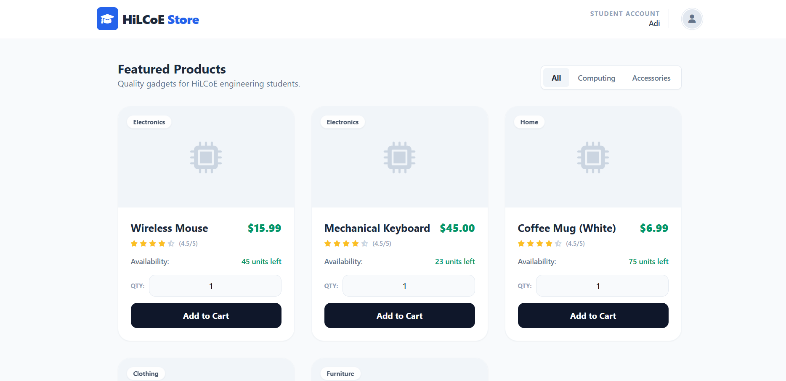
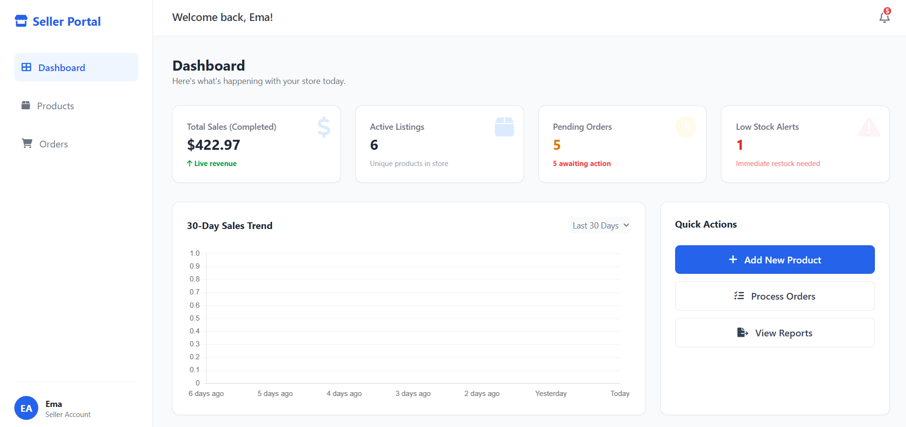

----------
# 📦 Order Management System: Enterprise Edition

### **The Gold Standard for Clean Architecture & DDD**

This project is a **Seller & Student Marketplace** designed as a practical implementation of modern **Software Architecture and Design Principles**.

Built using **Hexagonal Architecture (Ports & Adapters)**, this system enforces a strict separation between business logic and external concerns like databases, UI, and frameworks.

> 💡 The goal is not just functionality — but demonstrating **how real-world scalable systems are designed.**

---




---

## 📑 Navigation Guide

### 👀 Overview
* [🚀 1. Project Background](#1-project-background-)
* [🎯 2. Key Features & Goals](#2-key-features--goals-)

### 🏗 Architecture & Design
* [🧠 3. Domain Layer (DDD)](#3-domain-layer-ddd)
* [⚙️ 4. Application Layer (Use Cases)](#4-application-layer-the-orchestrator)
* [🔌 5. Infrastructure Layer](#5-infrastructure-layer-the-tools)
* [🎨 6. Presentation Layer](#6-presentation-layer-the-ui)

### 🔄 System Design Decisions
* [🔑 7. ID Strategy & Data Flow](#7-the-id-strategy--triple-model-flow)
* [⚡ 8. CQRS Implementation](#8-implementation-of-cqrs)

### 🚀 Getting Started
* [🛠️ 9. How to Run](#9-how-to-run-)

---

## 1. Project Background 🚀

This system evolved through key architectural improvements:

1. **From Sequential IDs → UUIDs**  
   Replaced predictable database IDs with secure, public-facing UUIDs.

2. **Strict Type Safety Across Layers**  
   Eliminated mismatches between:
    - Web Layer → `String`
    - Domain Layer → `UUID`
    - Database Layer → `Long`

3. **Cross-Aggregate Mapping**  
   Maintained a **normalized database** while presenting **human-readable UI data**.

---

## 2. Key Features & Goals 🎯

* 🔐 Secure Public IDs using UUIDs (No predictable URLs)
* 🧱 Clean Architecture (Hexagonal + DDD)
* ⚡ CQRS Pattern (Separate Read & Write Logic)
* 🎯 Type-Safe Layer Communication (String ↔ UUID ↔ Long)
* 🛍️ Dual UI System:
    * Seller Dashboard (Admin Panel)
    * Student Storefront (Customer View)
* 🔍 Search & Stock Awareness (Real-time UX improvements)

---

## 3. Domain Layer (DDD) 🧠

The **heart of the system**, where all business rules live.

### Core Concepts:

* **Order (Aggregate Root) 👑**
    - Controls lifecycle: `PENDING → SHIPPED → DELIVERED`
    - Ensures business invariants

* **Public ID (UUID) 🔑**
    - External identity of the system
    - Hides internal database structure

* **OrderItem (Value Object) 📦**
    - Immutable
    - Represents items within an order

* **OrderFactory 🏗️**
    - Responsible for:
        - Creating new Orders
        - Assigning UUIDs
        - Setting initial state

---

## 4. Application Layer: The Orchestrator ⚙️

This layer handles **use cases and system workflows**.

### Responsibilities:

* **Command Handlers (Write Operations) ✍️**
    - Example: `PlaceOrderHandler`
    - Convert UI input → Domain models
    - Enforce business rules before saving

* **Query Handlers (Read Operations) 📖**
    - Example: `OrderQueryHandler`
    - Transform data → UI-friendly DTOs

* **Dependency Inversion**
    - Defines repository interfaces
    - Keeps domain independent from infrastructure

---

## 5. Infrastructure Layer: The Tools 🔌

Handles all **external systems and technical details**.

### Components:

* **Persistence Model (`OrderEntity`)**
    - Maps domain → database (JPA)

* **Repository Implementations**
    - Implements domain interfaces

* **Database Management**
    - MySQL + Hibernate
    - Automatic schema updates (`ddl-auto`)

---

## 6. Presentation Layer: The UI 🎨

Where users interact with the system.

### Interfaces:

* 🛍️ **Student Storefront**
    - Browse products
    - Search in real-time
    - View stock availability

* 🧑‍💼 **Seller Dashboard**
    - Manage orders
    - Track status
    - Handle fulfillment

* 🔒 **Type-Safe Controllers**
    - Accept `String` inputs (UUIDs)
    - Prevent request errors (`400 Bad Request`)

---

## 7. The ID Strategy & Triple-Model Flow 🔄

A key architectural decision for **security + performance**:

| Layer        | ID Type         | Purpose                          |
|--------------|----------------|----------------------------------|
| Database     | `Long`         | Fast indexing & primary keys     |
| API / URL    | `UUID (String)`| Secure external exposure         |
| Domain       | `UUID`         | Business identity consistency    |

> 💡 This separation prevents data leaks while maintaining performance.

---

## 8. Implementation of CQRS ⚡

Command Query Responsibility Segregation improves clarity and scalability.

| Feature         | Commands (Write) ✍️     | Queries (Read) 📖        |
|-----------------|------------------------|--------------------------|
| Goal            | Data Integrity         | Fast Data Retrieval      |
| Logic           | Validation & Rules     | Data Transformation      |
| Output          | Save to DB             | Return DTOs              |

### Benefits:
* Cleaner code separation
* Easier scaling
* Better performance tuning

---

## 9. How to Run 🛠️

### 1. Database Setup

```sql
CREATE DATABASE order_mgmt_db;

-----
```
#### 2. Access the System
````
🧑‍💼 Seller Admin Dashboard
   http://localhost:8080/

🛍️ Student Storefront
    http://localhost:8080/store
````
-----