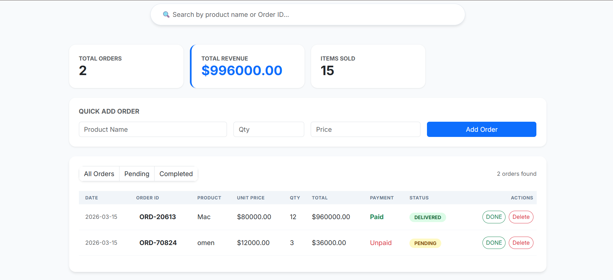
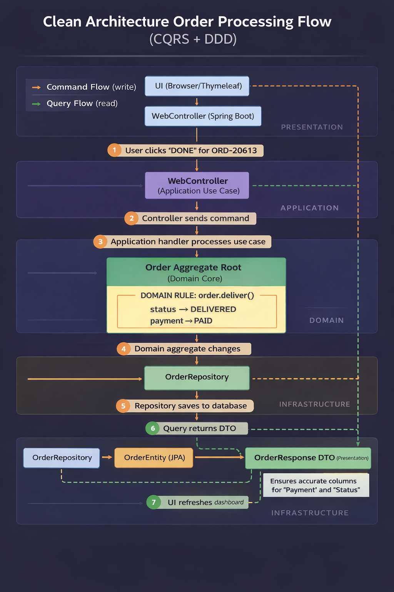

# 📦 Order Management System: Seller Dashboard




### **The Enterprise Standard for Clean Code**

This isn't just a simple CRUD app. This project is a high-performance **Seller Dashboard** engineered with a strict **Hexagonal Architecture**. By decoupling the core business logic from technical details like MySQL and Thymeleaf, we’ve built a system that is as scalable as it is maintainable.

---

---

## 📑 Quick Navigation

* [🚀 Introduction](https://www.google.com/search?q=%231-introduction-)
* [🧠 Domain Layer (The Heart)](https://www.google.com/search?q=%232-domain-layer-aggregates--value-objects-)
* [⚙️ Application Layer (The Orchestrator)](https://www.google.com/search?q=%233-application-layer-the-orchestrator-%EF%B8%8F)
* [🔌 Infrastructure Layer (The Tools)](https://www.google.com/search?q=%234-infrastructure-layer-the-tools-)
* [🎨 Presentation Layer (The UI)](https://www.google.com/search?q=%235-presentation-layer-the-ui-)
* [🔄 The Three-Model Flow](https://www.google.com/search?q=%236-the-three-model-enterprise-flow-)
* [⚡ CQRS Implementation](https://www.google.com/search?q=%237-implementation-of-cqrs-)
* [🛠️ Getting Started](https://www.google.com/search?q=%238-how-to-run-%EF%B8%8F)

---

---

## 1. Introduction 🚀

In a real enterprise environment, the "How" (Business Rules) should never be tangled with the "Where" (Database/UI).

* **Decoupled Logic:** Whether we use **MySQL**, PostgreSQL, or even an Excel sheet, the core logic of processing an order remains untouched.
* **Seller-Centric:** Designed specifically for fundamental order fulfillment and real-time tracking.

---

## 🧠 2. Domain Layer: Aggregates & Value Objects 

We use **Domain-Driven Design (DDD)** basic concepts to ensure the data  always tobo consistent and valid.

* **Order (Aggregate Root) 👑:** The entry point for all order logic. It guards the lifecycle of an order (e.g., ensuring an order can't be "Delivered" before it's "Paid").
* **OrderItem (Value Object) 📦:** Immutable units representing the products. They don't have their own ID; they exist only as part of the Order.
* **OrderFactory 🏗️:** Enforces strict business rules during creation, ensuring every order starts with a unique UUID and a "Pending" status.

---

---

## ⚙️ 3. Application Layer: The Orchestrator 

This layer contains the **Use Cases** of the system. It doesn't contain business rules (those are in the Domain), but it knows *how* to coordinate the work.

* **Command Handlers (Write Path):** These handlers (like `PlaceOrderHandler` or `UpdateStatusHandler`) receive a request, load the **Aggregate** from the database, tell the Aggregate to perform a business action, and then save the result.
* **Query Handlers (Read Path):** These focus on speed. They bypass complex business logic to fetch **DTOs** directly for the UI.
* **The "Glue":** This layer defines the interfaces (like `OrderRepository`) that the Infrastructure layer must implement, keeping the system flexible.

---


## 🔌 4. Infrastructure Layer: The Tools

This is where the "heavy lifting" happens. This layer contains everything that talks to external systems.

* **Persistence:** Contains the `OrderRepositoryImpl` and `OrderEntity`. It handles the raw SQL/JPA logic to save your data to **MySQL**.
* **Configuration:** Sets up the Spring Boot beans and security settings.
* **Independence:** Because of the **Dependency Inversion Principle**, you could swap this entire layer for a MongoDB implementation without touching your Domain logic.

---

## 🎨 5. Presentation Layer: The UI

The outermost shell that interacts directly with the user.

* **Web Controllers:** Handle the incoming HTTP requests and map them to Application commands.
* **Thymeleaf Templates:** Renders the **Seller Dashboard**.
* **The Buffer:** This layer strictly uses **OrderResponse DTOs**. It never sees the `OrderEntity`, which prevents the "switched columns" bug we fixed!

---

## 🔄 6. The Three-Model Enterprise Flow 

To prevent "leaky abstractions," we maintain three distinct versions of our data. This ensures the UI never dictates how the database is structured.

1. **Domain Model (`Order.java`)**: The source of truth. Pure Java, zero dependencies.
2. **Persistence Model (`OrderEntity.java`)**: The database specialist. Maps our domain logic to **MySQL** via JPA.
3. **Presentation Model (`OrderResponse.java`)**: The UI specialist. A **DTO** that flattens data for a lightning-fast dashboard experience.

---


## ⚡ 7. Implementation of CQRS 

We separate **Writes** from **Reads** to maximize efficiency.

| Feature | Commands (Write) ✍️ | Queries (Read) 📖 |
| --- | --- | --- |
| **Primary Goal** | Data Integrity | High-Speed Display |
| **Logic Type** | Business Validation | Data Transformation |
| **Main Model** | Domain Aggregate | Optimized DTO |

---

### 🏗️ Strategic Design Patterns 

* **Use Case Pattern:** Every action (like `UpdateStatusHandler`) is a standalone unit. This makes testing incredibly easy.
* **Repository Pattern:** A "gatekeeper" that hides the complexity of MySQL from the rest of the app.
* **DTO Pattern:** Prevents security risks by only sending the UI exactly what it needs—nothing more, nothing less.

---

## 8. How to Run 🛠️

### **1. Prepare the Database**

Run this in your MySQL instance:

```sql
CREATE DATABASE order_mgmt_db;

```

### **2. Configure Environment**

Set these variables to connect:

* `DB_USERNAME`: *your_username*
* `DB_PASSWORD`: *your_password*

### **3. Launch the App**

```bash
./mvnw spring-boot:run

```

✨ **Dashboard Live at:** `http://localhost:8080`

---